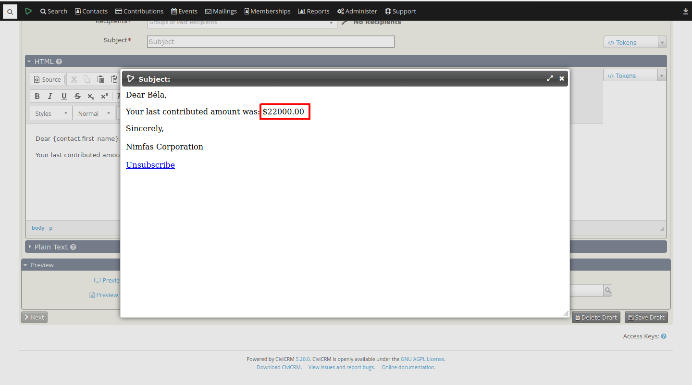
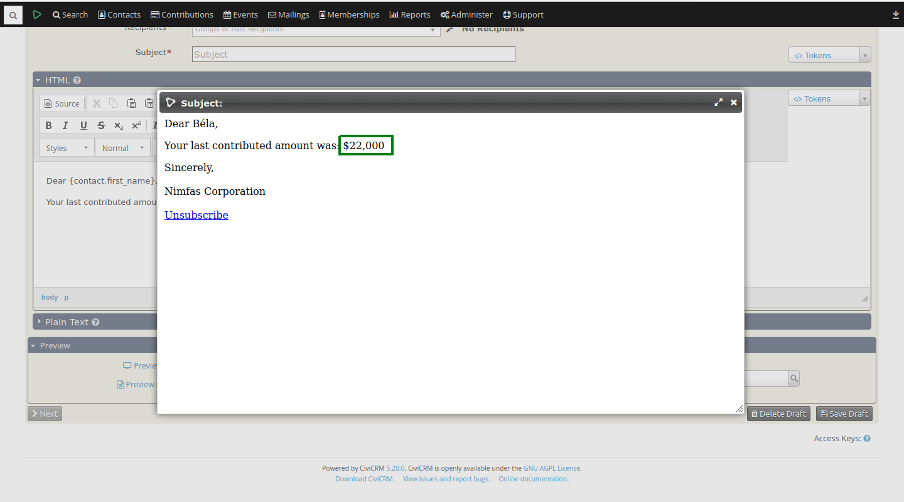

# number-grouping


## Before



## After



This extension formats numbers displayed in contact tokens. It respects the `Thousands Separator` & `Decimal Delimiter`
settings from **Administer >> Localization >> Languages, Currency, Locations**.

The extension is licensed under [AGPL-3.0](LICENSE.txt).

## Requirements

* PHP v7.3+
* CiviCRM (5.0)
* [RC-Base](https://github.com/reflexive-communications/rc-base) v0.8.0+

## Installation

Sysadmins and developers may clone the [Git](https://en.wikipedia.org/wiki/Git) repo for this extension and install it
with the command-line tool [cv](https://github.com/civicrm/cv).

```bash
git clone https://github.com/reflexive-communications/number-grouping.git
cv en number_grouping
```

## Usage

When using tokens numbers will be formatted as configured.

## Known limitation

- Number of decimals displayed can't be set. Currently it is null.
- If no decimals are displayed and a value the literal zero, nothing will be displayed.
