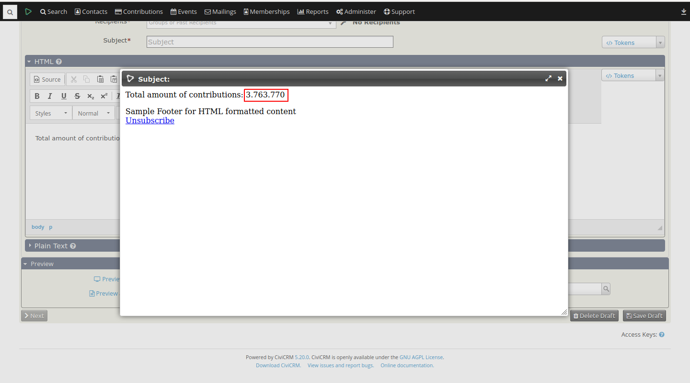

# hu.es-progress.number-grouping



This extension formats numbers displayed in contact email tokens.

Current format groups numbers by thousands, displays no decimals and use the '.' (period)
as thousands separator.

The extension is licensed under [AGPL-3.0](LICENSE.txt).

## Requirements

* PHP v7.0+
* CiviCRM (5.0)

## Installation (Web UI)

This extension has not yet been published for installation via the web UI.

## Installation (CLI, Zip)

Sysadmins and developers may download the `.zip` file for this extension and
install it with the command-line tool [cv](https://github.com/civicrm/cv).

```bash
cd <extension-dir>
cv dl hu.es-progress.number-grouping@https://github.com/semseysandor/hu.es-progress.number-grouping/archive/master.zip
```

## Installation (CLI, Git)

Sysadmins and developers may clone the [Git](https://en.wikipedia.org/wiki/Git) repo for this extension and
install it with the command-line tool [cv](https://github.com/civicrm/cv).

```bash
git clone https://github.com/semseysandor/hu.es-progress.number-grouping.git
cv en number_grouping
```

## Usage

CiviMail email tokens

## Known limitation

If a value is zero, nothing will be displayed
